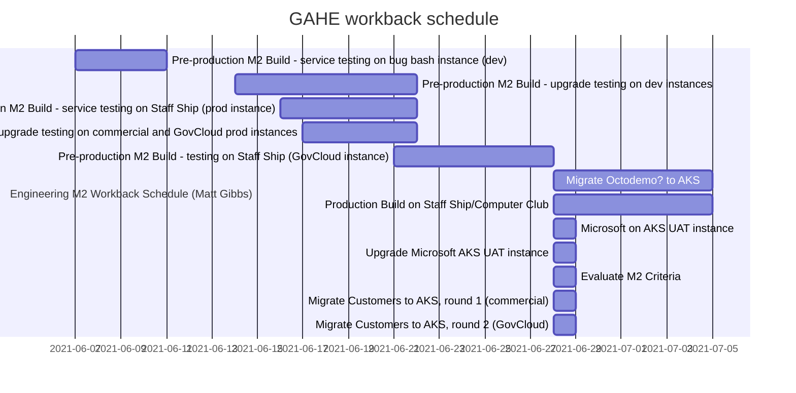

# Test this out

Here is an inline mermaid file

<!-- generated by mermaid compile action - START -->

  
Mermaid markup

```mermaid
gantt
    title GAHE workback schedule
    dateFormat  YYYY-MM-DD
    section Engineering M2 Workback Schedule (Matt Gibbs)	
    Pre-production M2 Build - service testing on bug bash instance (dev)                    :a1, 2021-06-07, 4d
    Pre-production M2 Build - upgrade testing on dev instances                              :a2, 2021-06-14, 8d
    Pre-production M2 Build - service testing on Staff Ship (prod instance)                 :a2, 2021-06-16, 6d
    Pre-production M2 Build - upgrade testing on commercial and GovCloud prod instances     :a2, 2021-06-17, 5d
    Pre-production M2 Build - testing on Staff Ship (GovCloud instance)                     :a3, 2021-06-21, 7d
    Migrate Octodemo? to AKS                                                                :after a3, 7d
    Production Build on Staff Ship/Computer Club                                            :after a3, 7d
    Microsoft on AKS UAT instance                                                           :after a3, 1d
    Upgrade Microsoft AKS UAT instance                                                      :after a3, 1d
    Evaluate M2 Criteria                                                                    :after a3, 1d
    Migrate Customers to AKS, round 1 (commercial)                                          :after a3, 1d
    Migrate Customers to AKS, round 2 (GovCloud)                                            :after a3, 1d
```

<!-- generated by mermaid compile action - END -->
